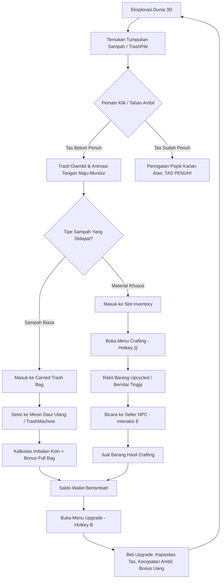

# Gedede - Clean Up Game Jam Project

Dokumentasi teknis komprehensif, arsitektur sistem, dan referensi API kode untuk proyek game **Gedede** (Clean Up Jam Project).

---

## Daftar Isi
1. [Gambaran Umum Proyek](#1-gambaran-umum-proyek)
2. [Core Gameplay Loop & Alur Permainan](#2-core-gameplay-loop--alur-permainan)
3. [Arsitektur Sistem & Struktur Folder](#3-arsitektur-sistem--struktur-folder)
4. [Daftar Kontrol Pemain (Player Controls)](#4-daftar-kontrol-pemain-player-controls)
5. [Dokumentasi Lengkap Modul & Skrip](#5-dokumentasi-lengkap-modul--skrip)
   - [5.1 Modul Karakter Pemain & Viewmodel](#51-modul-karakter-pemain--viewmodel)
   - [5.2 Modul Pengambilan & Dunia Sampah](#52-modul-pengambilan--dunia-sampah)
   - [5.3 Modul Inventaris & Sistem Crafting](#53-modul-inventaris--sistem-crafting)
   - [5.4 Modul Ekonomi, Upgrade & Pedagang](#54-modul-ekonomi-upgrade--pedagang)
   - [5.5 Modul Antarmuka Pengguna (UI & HUD)](#55-modul-antarmuka-pengguna-ui--hud)
   - [5.6 Modul Editor & Tooling](#56-modul-editor--tooling)
6. [Formula Matematika & Algoritma Kunci](#6-formula-matematika--algoritma-kunci)
7. [Panduan Setup & Menjalankan di Unity 6](#7-panduan-setup--menjalankan-di-unity-6)

---

## 1. Gambaran Umum Proyek

- **Engine Target**: Unity 6 (6000.4.2f1)
- **Render Pipeline**: Universal Render Pipeline (URP)
- **Input System**: Unity New Input System Package
- **Genre**: First-Person Cleaning, Upcycling & Economy Simulation
- **Premis**: Pemain berperan sebagai pembersih lingkungan bersenjatakan alat penjepit (*Rusty Trash Picker*). Pemain menjelajahi area 3D, mengambil tumpukan sampah, mengelola kapasitas kantong (*Bag*), menyetorkan sampah biasa ke Mesin Daur Ulang untuk mendapatkan imbalan koin, merakit sampah khusus menjadi barang bernilai tinggi (*upcycling*), menjualnya ke pedagang (*Seller NPC*), serta membeli upgrade permanen untuk memaksimalkan efisiensi kerja.

---

## 2. Core Gameplay Loop & Alur Permainan



### Tahapan Alur Permainan:
1. **Pembersihan (Collection Phase)**:
   - Pemain mengarahkan kursor/crosshair ke arah sampah (jarak jangkauan `pickupRange`).
   - Setiap klik kiri atau tombol `E`, alat penjepit tangan kanan menjulur maju-mundur secara halus.
   - Sampah terbang (*arc animation*) menuju posisi pemain.
2. **Pengelolaan Kapasitas (Capacity Management)**:
   - Tas memiliki batas tampung (`bagCapacity`).
   - Jika tas penuh, pemain tidak dapat mengambil sampah biasa lagi, dan HUD kanan atas memunculkan peringatan merah bergetar.
3. **Penyetoran & Ekonomi (Recycling & Economy)**:
   - Pemain mendatangi `TrashMachine` dan menekan interaksi untuk menyetorkan seluruh muatan tas.
   - Semakin penuh tas saat disetor, semakin besar bonus uang yang diperoleh via `DepositRewardCalculator`.
4. **Perakitan & Perdagangan (Upcycling & Trading)**:
   - Sampah material tertentu dirakit di `CraftingPanel` menjadi barang bernilai ekonomis tinggi.
   - Barang dijual ke `SellerNpc` untuk menghasilkan keuntungan besar.
5. **Peningkatan Karakter (Progression & Upgrades)**:
   - Uang digunakan di `UpgradePanel` untuk memperluas kapasitas kantong, mempercepat delay pengambilan, dan meningkatkan multiplier penghasilan.

---

## 3. Arsitektur Sistem & Struktur Folder

```
Assets/
├── Script/
│   ├── Player/                     # Kontrol pergerakan, kamera, raycast interaksi
│   │   └── Player.cs
│   ├── FirstPersonHands.cs         # Animasi tangan first-person (walk-bob & grab)
│   ├── TrashPile.cs                # Tumpukan sampah 3D (3 fase visual)
│   ├── WorldTrashPickup.cs         # Objek sampah lepasan di map
│   ├── TrashMachine.cs             # Mesin setor sampah
│   ├── TrashDropTable.cs           # ScriptableObject tabel drop peluang item
│   ├── RandomTrashSpawner.cs       # Spawner prosedural tumpukan sampah
│   ├── Economy/                    # Sistem wallet, upgrade, toko, kalkulator reward
│   │   ├── CurrencyWallet.cs
│   │   ├── DepositRewardCalculator.cs
│   │   ├── EconomyBootstrap.cs
│   │   ├── EconomySaveData.cs
│   │   ├── EconomySaveService.cs
│   │   ├── ItemShopDefinition.cs
│   │   ├── ItemShopManager.cs
│   │   ├── PlayerUpgradeManager.cs
│   │   ├── SellerManager.cs
│   │   ├── SellerNpc.cs
│   │   └── UpgradeDefinition.cs
│   ├── Inventory/                  # Sistem penyimpanan slot & crafting
│   │   ├── CraftingManager.cs
│   │   ├── CraftingRecipe.cs
│   │   ├── InventoryManager.cs
│   │   ├── ItemDefinition.cs
│   │   └── ItemStack.cs
│   └── UI/                         # Komponen antarmuka & HUD
│       ├── BagCounter.cs
│       ├── CraftingPanel.cs
│       ├── CrosshairDot.cs
│       ├── HandOverlay.cs
│       ├── InventoryFullWarning.cs
│       ├── InventoryPanel.cs
│       ├── InventorySlotView.cs
│       ├── ItemDescriptionPanel.cs
│       ├── PanelHotkeyController.cs
│       ├── PauseMenu.cs
│       ├── SellerPanel.cs
│       ├── UpgradeCardView.cs
│       ├── UpgradePanel.cs
│       └── WalletCounter.cs
├── Prefab/                         # Prefab tangan, UI, sampah
├── Scenes/                         # Scene game utama (SampleScene)
├── Resources/                      # UpgradeDefinition runtime fallback
└── Editor/                         # Script helper, fix bugs, menu builder
```

---

## 4. Daftar Kontrol Pemain (Player Controls)

| Aksi | Tombol Default | Keterangan |
|---|---|---|
| Bergerak | `W`, `A`, `S`, `D` | Berjalan ke depan, belakang, samping |
| Rotasi Kamera | `Gerakan Mouse` | Mengarahkan pandangan sudut pandang orang pertama |
| Mengambil Sampah | `Klik Kiri (LMB)` / `E` | Menjangkau sampah ke depan (bisa ditahan untuk continuous pickup) |
| Interaksi Objek / NPC | `E` | Membuka toko seller, menyetor sampah ke mesin |
| Melompat | `Space` | Lompat sesuai gaya gravitasi |
| Menu Inventaris | `Tab` | Membuka/menutup grid inventaris barang |
| Menu Crafting | `Q` | Membuka/menutup menu perakitan barang daur ulang |
| Menu Upgrade | `B` | Membuka/menutup jendela pembelian upgrade pemain |
| Pause / Keluar Menu | `Escape` | Membuka menu pause atau menutup panel aktif |

---

## 5. Dokumentasi Lengkap Modul & Skrip

### 5.1 Modul Karakter Pemain & Viewmodel

#### `Player.cs`
Merupakan pusat pengontrol entitas pemain dalam scene 3D.
- **Tanggung Jawab Utama**:
  - Mengatur fisika gerak dan gravitasi melalui `CharacterController`.
  - Membaca input rotasi mouse untuk kamera first-person (`playerCamera`).
  - Mengelola logika pengambilan sampah (`HandlePickup`) melalui Raycast ke arah tengah layar dan fallback `Physics.OverlapSphere`.
  - Mengelola kapasitas kantong sampah bawaan (`carriedTrash` vs `bagCapacity`).
  - Menyediakan event `BagChanged` saat jumlah sampah bertambah atau berkurang.
  - Berinteraksi dengan `TrashMachine`, `SellerNpc`, dan mengarahkan animasi ke `FirstPersonHands`.
- **Fungsi-Fungsi Kunci**:
  - `Awake()` & `Start()`: Menginisialisasi komponen `CharacterController`, mengunci kursor, menyambungkan referensi `FirstPersonHands` (dengan fallback pencarian dinamis), dan memastikan modul `InventoryManager` serta `CurrencyWallet` terpasang.
  - `Update()`: Memanggil pergerakan horizontal, vertikal (gravitasi), orientasi kamera, dan `HandlePickup()`.
  - `HandlePickup()`: Menangani deteksi klik mouse / tahan klik kiri / tombol `E`. Jika target valid ditemukan, memicu `PlayGrab()` pada tangan, memeriksa ketersediaan ruang di tas, dan memproses penambahan sampah atau item. Jika tas penuh saat mencoba mengambil, memanggil `InventoryFullWarning.TriggerAlert()`.
  - `TryAddTrash(int amount)`: Memvalidasi penambahan sampah ke dalam tas. Mengembalikan `false` jika melebihi kapasitas dan memicu peringatan tas penuh.
  - `DepositTrash()`: Menghitung imbalan via `DepositRewardCalculator`, menambahkan koin ke `CurrencyWallet`, mereset `carriedTrash` menjadi `0`, dan memicu event `BagChanged`.
  - `SetBagCapacityBonus(int amount)`: Menyesuaikan kapasitas tas berdasarkan upgrade pemain.

---

#### `FirstPersonHands.cs`
Mengontrol visual tangan dan alat penjepit di layar pemain (Canvas UI).
- **Tanggung Jawab Utama**:
  - Memberikan efek dinamis *head-bobbing* / *hand-bobbing* saat pemain berjalan di dunia 3D.
  - Memainkan animasi menjangkau (*grab animation*) saat pemain mengambil sampah.
  - Didesain secara murni menggunakan prinsip **pergeseran posisi maju-mundur (pure positional displacement)** tanpa distorsi rotasi atau perubahan skala yang tidak wajar.
- **Variabel Konfigurasi**:
  - `moveThreshold`: Kecepatan minimum pemain agar dianggap sedang berjalan (default: `0.05f`).
  - `walkFrequency`: Frekuensi kecepatan ayunan sinusoidal (default: `6f`).
  - `verticalBob` & `horizontalBob`: Jarak offset naik-turun dan kiri-kanan dalam pixel (default: `14f` dan `5f`).
  - `rotationAmount`: Kemiringan dinamis tangan saat melangkah (default: `3f` derajat).
  - `grabDuration`: Total durasi siklus maju-mundur penjepit (default: `0.22f` detik).
  - `grabForwardOffset`: Arah vektor jangkauan tangan kanan saat maju (default: `(-150f, 130f)`).
- **Fungsi-Fungsi Kunci**:
  - `UpdateGrabState()`: Mengkalkulasi progres kurva `grabProgress` (0 ke 1 ke 0). Mencapai titik terjauh (*peak*) pada 35% durasi dengan kurva sinus cepat, kemudian kembali mundur secara halus (*ease-in-out cosine*).
  - `AnimateHands(bool isMoving)`: Menggabungkan posisi dasar tangan, offset ayunan melangkah, dan offset jangkauan grab ke `rightHand.anchoredPosition`.
  - `PlayGrab()`: Memulai animasi grab secara instan.

---

### 5.2 Modul Pengambilan & Dunia Sampah

#### `TrashPile.cs`
Representasi tumpukan sampah 3D interaktif di dunia permainan.
- **Fitur Utama**:
  - Memiliki 3 tahap visualisasi (`stageOne`, `stageTwo`, `stageThree`) yang secara otomatis menyusut seiring berkurangnya sampah yang diambil.
  - Menggunakan sistem `TrashDropTable` atau daftar `ItemDrop` berkemungkinan persentase untuk menentukan apakah pemain memperoleh sampah biasa atau barang material khusus.
  - `FlyTrashToPlayer`: Coroutine yang memunculkan sprite sampah terbang melayang ke arah posisi pemain saat berhasil diambil.
- **Fungsi-Fungsi Kunci**:
  - `TryCollect(Transform playerTarget, Func<PickupResult, bool> tryAcceptPickup)`: Menguji apakah tumpukan masih memiliki sampah (`remainingTrash > 0`). Jika pemain menerima sampah, jumlah sampah dikurangi dan visual diperbarui.
  - `UpdatePileVisual()`: Mengaktifkan mesh collider dan renderer fase 3, 2, atau 1 sesuai persentase sisa sampah.

#### `WorldTrashPickup.cs`
Objek sampah satuan independen yang berserakan di tanah.
- Menyimpan kuantitas dan referensi `ItemDefinition`.
- Memiliki fungsi `TryCollect(Func<bool> onCollected)` yang langsung menghancurkan objek (`Destroy`) saat pemain memungutnya.

#### `TrashMachine.cs`
Objek mesin daur ulang tempat pemain menyetorkan isi kantong sampah.
- Mengecek jarak posisi pemain terhadap mesin (`depositRange`, default: `3f`).
- Menjalankan `player.DepositTrash()` saat pemain menekan interaksi pada mesin.

#### `TrashDropTable.cs`
Aset `ScriptableObject` penentu distribusi probabilitas drop:
- Menampung bobot kemunculan untuk berbagai `ItemDefinition` dan persentase sampah biasa (*ordinary trash*).
- Fungsi `Roll(bool allowEmpty)`: Melakukan pengacakan tertimbang (*weighted roll*) untuk menentukan hasil drop.

#### `RandomTrashSpawner.cs`
Komponen pembuat sampah otomatis di dalam area radius tertentu untuk memastikan dunia permainan tidak kehabisan sampah.

---

### 5.3 Modul Inventaris & Sistem Crafting

#### `InventoryManager.cs`
Pengelola seluruh slot penyimpanan barang bawaan pemain.
- **Tanggung Jawab Utama**:
  - Mengelola daftar slot `ItemStack`.
  - Menangani penggabungan tumpukan (*stacking*) berdasarkan batasan `ItemDefinition.StackLimit`.
  - Menangani penambahan slot baru saat kapasitas diperluas (`SetSlotCapacity`).
  - Memancarkan event `InventoryChanged` ke seluruh antarmuka UI.
- **Fungsi-Fungsi Kunci**:
  - `AddItem(ItemDefinition item, int quantity)`: Menambahkan item ke slot yang sudah ada terlebih dahulu sebelum mengisi slot kosong.
  - `RemoveItem(ItemDefinition item, int quantity)`: Mengurangi kuantitas item dari inventaris.
  - `CanAddItem(ItemDefinition item, int quantity)`: Melakukan simulasi apakah sisa slot dan kapasitas tumpukan mencukupi.
  - `GetItemCount(ItemDefinition item)`: Menghitung total jumlah item tertentu di seluruh slot.

#### `ItemDefinition.cs`
ScriptableObject cetak biru (*blueprint*) suatu item:
- Menyimpan: `itemId`, `displayName`, `description`, `icon`, `basePrice`, `stackLimit`, dan kategori kelangkaan (*rarity*).

#### `ItemStack.cs`
Kelas data sederhana penyimpan status satu slot inventaris:
- Properti: `ItemDefinition item`, `int quantity`.
- Helper: `IsEmpty` (mengembalikan `true` jika item null atau kuantitas <= 0), `Clear()`.

#### `CraftingRecipe.cs`
ScriptableObject penentu formula resep perakitan:
- `List<ItemStack> ingredients`: Bahan baku yang dibutuhkan beserta jumlahnya.
- `ItemDefinition resultItem`: Produk hasil daur ulang.
- `int resultQuantity`: Jumlah unit produk yang dihasilkan.

#### `CraftingManager.cs`
Mesin logika eksekutor crafting:
- `CanCraft(CraftingRecipe recipe)`: Memeriksa apakah inventaris memiliki semua bahan baku sesuai resep dan memiliki ruang untuk menampung hasil jadi.
- `Craft(CraftingRecipe recipe)`: Mengambil bahan dari inventaris pemain dan memasukkan produk jadi ke slot penyimpanan.

---

### 5.4 Modul Ekonomi, Upgrade & Pedagang

#### `CurrencyWallet.cs`
Pengelola saldo keuangan pemain.
- Properti `Balance`: Jumlah koin saat ini.
- Event `BalanceChanged(int newBalance)`: Terpicu setiap ada transaksi masuk atau keluar.
- Fungsi: `Add(int amount)`, `TrySpend(int amount, CurrencyTransactionSource source)`, `CanAfford(int amount)`.

#### `DepositRewardCalculator.cs`
Kalkulator statis matematis untuk sistem setor sampah mesin:
- Menghitung imbalan proporsional berdasarkan persentase isi kantong.
- Memberikan bonus tambahan signifikan jika pemain menyetorkan tas dalam kondisi **100% Penuh (Full Bag Bonus)**.

#### `PlayerUpgradeManager.cs`
Mengelola sistem progresi kemampuan pemain:
- Kategori upgrade:
  - `BagCapacity`: Meningkatkan muatan kantong sampah.
  - `PickupSpeed`: Mempercepat jeda waktu antar pengambilan sampah.
  - `FullbagBonus`: Meningkatkan pengali bonus uang saat setor tas penuh.
  - `Income`: Meningkatkan pengali pendapatan dasar.
- Fungsi: `TryPurchase(UpgradeDefinition upgrade)`, `GetLevel(upgrade)`, `GetNextPrice(upgrade)`, `IsMaxLevel(upgrade)`.

#### `UpgradeDefinition.cs`
ScriptableObject penentu skema biaya dan nilai peningkatan per level upgrade:
- Mendukung penetapan harga manual per level (`pricesByLevel`) atau formula pertumbuhan harga eksponensial otomatis (`priceGrowth`).

#### `SellerNpc.cs` & `SellerManager.cs`
- `SellerNpc`: Komponen yang ditempelkan pada objek NPC di dunia; membuka jendela `SellerPanel` saat pemain berinteraksi dalam jarak dekat.
- `SellerManager`: Mengurus transaksi penjualan item dari inventaris pemain ke pedagang dengan mengkalkulasi harga jual item (`basePrice`) dan mentransfer uang ke `CurrencyWallet`.

#### `EconomySaveService.cs` & `EconomySaveData.cs`
Sistem persistensi data pemain:
- Menyimpan: Saldo koin, daftar isi slot inventaris, dan level upgrade pemain.
- Format: Serialisasi JSON yang disimpan ke dalam `PlayerPrefs` atau file lokal.

---

### 5.5 Modul Antarmuka Pengguna (UI & HUD)

#### `CrosshairDot.cs`
Komponen HUD yang membuat titik bidik (*crosshair*) minimalis di tengah layar.
- Dibuat secara prosedural saat runtime jika belum ada sprite.
- Otomatis menyembunyikan diri saat game dijeda atau jendela menu (inventaris, crafting, upgrade, seller) sedang dibuka.

#### `InventoryFullWarning.cs`
Komponen notifikasi visual di pojok kanan atas layar:
- **Posisi**: Terpaku pada *Top-Right Anchor* `(1, 1)` dengan offset `(-24, -24)`.
- **Indikator**: Menampilkan panel gelap dengan garis aksen merah tebal, judul `"PERINGATAN: TAS PENUH!"`, dan pesan keterangan `"Kapasitas sampah penuh! Kosongkan di Mesin Daur Ulang."`.
- **Transisi**: Menggunakan `CanvasGroup` untuk efek fade-in/fade-out yang halus.
- **Shake Alert**: Memiliki fungsi `TriggerAlert()` yang menghasilkan animasi getar (*screen-shake*) kartu saat pemain tetap memaksakan mengambil sampah ketika kapasitas tas sudah maksimal.

#### `WalletCounter.cs`
Widget HUD di pojok kiri atas yang menampilkan ikon uang dan angka saldo koin secara real-time dari `CurrencyWallet`.

#### `BagCounter.cs`
Widget teks yang menampilkan jumlah muatan tas pemain (`Bag: X/Y`). Teks berubah warna menjadi merah saat kapasitas penuh tercapai.

#### `InventoryPanel.cs` & `InventorySlotView.cs`
- `InventoryPanel`: Menampilkan grid slot barang saat tombol `Tab` ditekan.
- `InventorySlotView`: Mengatur tampilan ikon item, label jumlah tumpukan (*stack count*), serta event klik pemilihan slot.

#### `CraftingPanel.cs`
Antarmuka visual untuk menampilkan daftar resep daur ulang yang tersedia. Tombol *craft* otomatis dinonaktifkan jika bahan baku tidak mencukupi.

#### `UpgradePanel.cs` & `UpgradeCardView.cs`
Antarmuka belanja upgrade pemain (hotkey `B`). Setiap kartu upgrade menampilkan ikon, nama, level saat ini, harga berikutnya, dan tombol beli.

#### `SellerPanel.cs`
Antarmuka interaksi saat berbicara dengan NPC pedagang untuk memilih barang yang hendak dijual.

#### `PanelHotkeyController.cs`
Pengatur terpusat untuk tombol pintas keyboard:
- Memastikan hanya satu jendela menu yang terbuka dalam satu waktu (menghindari tumpang-tindih UI).
- Mengatur status kunci kursor mouse (`CursorLockMode.Locked` vs `CursorLockMode.None`).

---

### 5.6 Modul Editor & Tooling

#### `EconomyBootstrap.cs`
Skrip inisialisasi otomatis yang berjalan saat game dimulai (`Awake`):
- Memastikan komponen inti seperti `CurrencyWallet`, `PlayerUpgradeManager`, dan `PanelHotkeyController` terpasang pada pemain.
- Menambahkan widget HUD esensial (`WalletCounter`, `CrosshairDot`, `InventoryFullWarning`) ke dalam *Canvas* secara otomatis jika belum ada di dalam scene.

#### `FixUnity6ImageBug.cs`
Skrip editor khusus untuk mengatasi *known issue* pada Unity 6 (UUM-96801 / `EditorStyles.get_toolbarButtonRight NullReferenceException`):
- Secara otomatis mendeseleksi objek dengan komponen UI Image sebelum domain reload untuk mencegah error editor.

---

## 6. Formula Matematika & Algoritma Kunci

### 1. Perhitungan Imbalan Setor Sampah (`DepositRewardCalculator.cs`)

Imbalan dasar dihitung proporsional terhadap keterisian tas:

$$\text{ProgressReward} = \text{BaseReward} \times \left( \frac{\min(\text{CarriedTrash}, \text{BagCapacity})}{\text{BagCapacity}} \right) \times \text{IncomeMultiplier}$$

Jika tas disetor dalam kondisi **100% Penuh** ($\text{CarriedTrash} \ge \text{BagCapacity}$):

$$\text{TotalReward} = \text{Round}(\text{ProgressReward}) + \text{Round}(\text{BaseReward} \times \text{FullBagBonusMultiplier})$$

---

### 2. Kurva Animasi Tangan Maju-Mundur (`FirstPersonHands.cs`)

Durasi dinormalisasi $t_n = \frac{t_{\text{elapsed}}}{\text{grabDuration}}$. Titik jangkauan terjauh berada pada fase $p = 0.35$ (35% durasi):

- **Fase Maju ($t_n \le 0.35$)** - *Sinusoidal Ease-Out*:
  $$\text{progress} = \sin\left(\frac{t_n}{0.35} \times \frac{\pi}{2}\right)$$

- **Fase Mundur ($t_n > 0.35$)** - *Cosine Ease-In-Out*:
  $$t_{\text{return}} = \frac{t_n - 0.35}{1 - 0.35}$$
  $$\text{progress} = 0.5 \times \left(1 + \cos(t_{\text{return}} \times \pi)\right)$$

Posisi akhir tangan kanan dihitung dengan:
$$\vec{P}_{\text{right}} = \vec{P}_{\text{base}} + (\vec{O}_{\text{forward}} \times \text{progress})$$

---

## 7. Panduan Setup & Menjalankan di Unity 6

1. **Buka Proyek**:
   - Jalankan Unity Hub dan buka folder `d:\GameTastic\Gamjam` menggunakan editor **Unity 6 (6000.4.2f1)** atau versi kompatibel.
2. **Buka Scene Utama**:
   - Buka file scene: `Assets/Scenes/SampleScene.unity`.
3. **Konfigurasi Canvas**:
   - Pastikan terdapat objek berlabel `Canvas` di dalam scene hierarchy. Komponen `EconomyBootstrap` pada objek `Player` akan otomatis melengkapi seluruh widget HUD yang belum terpasang (`WalletCounter`, `CrosshairDot`, `InventoryFullWarning`).
4. **Masuk ke Play Mode**:
   - Klik tombol **Play** di Unity Editor.
   - Gunakan `W/A/S/D` untuk berjalan dan `Klik Kiri` mouse untuk mengambil sampah.
   - Uji kapasitas tas hingga penuh untuk melihat notifikasi peringatan di pojok kanan atas, lalu datangi mesin silinder daur ulang untuk menyetorkan sampah.

---
*Dokumentasi ini disusun secara komprehensif untuk memudahkan pengembangan, pemeliharaan, serta perluasan fitur proyek Game Jam Gedede.*
